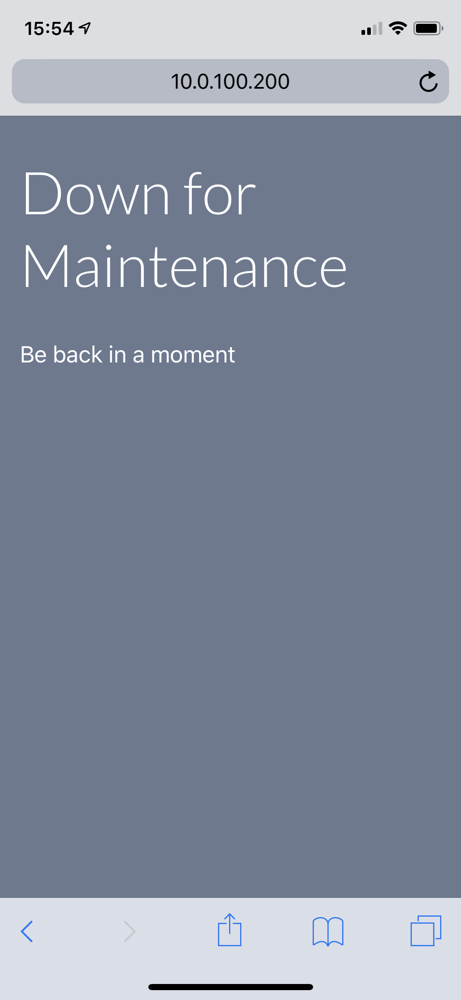
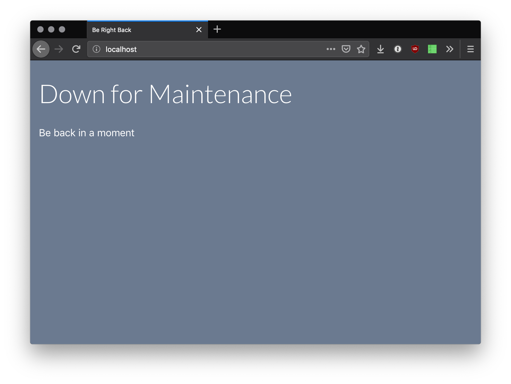

# brb-site

> Simple web server that returns a maintenance message

Sure, it shouldn't ever happen. Failover should work just fine. The deploy should be instant. Then, somehow, the worst happens: it stalls. You need a downtime message, and fast! Just type `brb-site` and breathe easily for a moment.

`brb-site` serves a simple downtime message HTML page with client-side JavaScript to push users to your site once it's back. Every 15 seconds, the page makes a request to the server in the background. So long as it gets back a response, the page reloads. If `brb-site` is still running, nothing will change. If your site is back, this ensures they're bounced back to it as soon as possible. If the server is hard-down while your site is spinning up, the page won't reload until it's up.

<p align="center">
 
</p>

## Install

```bash
$ npm install -g brb-site
```

## Usage

```bash
$ brb-site
```

Alternatively, use `npm link` to link the cli interface globally.
```bash
$ npm install
$ npm link
$ brb-site
```

A `pm2` ecosystem file is also included. To run as a daemon, install `pm2` and run:
```bash
$ pm2 start ecosystem.config.js
```

## Configuration

Configuration is pulled from the process `env`, or a `.env` file if one is present.

`PORT`

Number. Which port to run the server on. Default: `80`

`VERBOSE`

Boolean. Whether to log all requests to the console. Default: `true`

```bash
$ export PORT=8080 && brb-site
```

## Dependency

You may also use `brb-site` as a dependency in your project.

```javascript
const BRBServer = require('brb-site');

const brb = new BRBServer({ port: 8080, verbose: true });

brb.start();
// ...
brb.stop();
```

## FAQ

> Is this some kind of joke?

Yes.

## License

MIT © Jesse Youngblood
